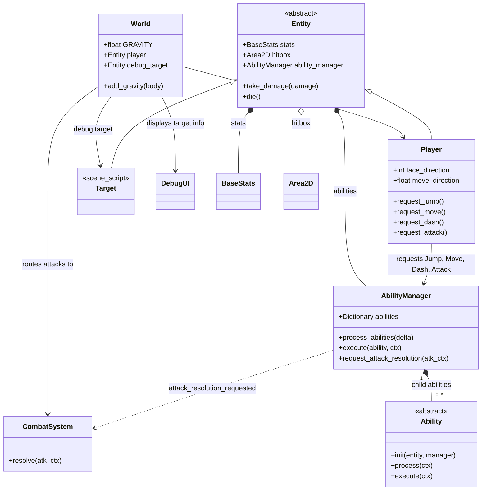
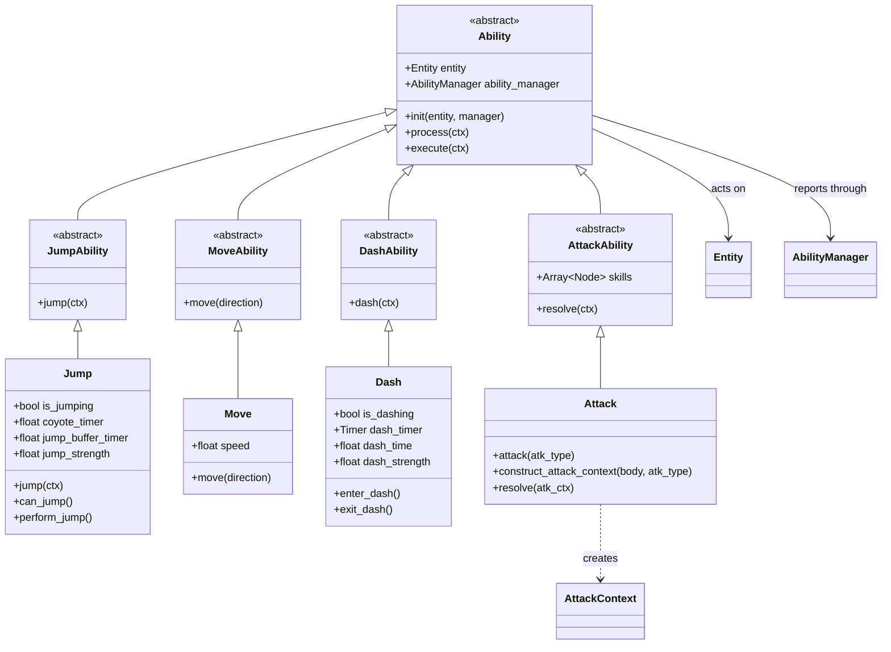
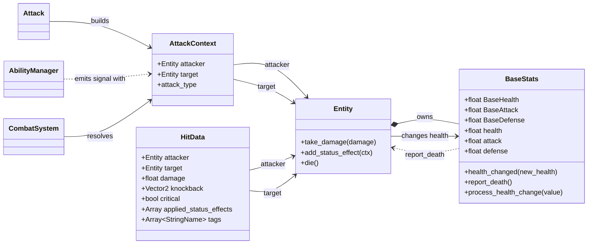

# UML

## System Overview

```mermaid
classDiagram
    direction TB

    World --> Player : owns reference
    World --> Target : debug target
    World --> CombatSystem : routes attacks to
    World --> DebugUI : displays target info

    Entity <|-- Player
    Entity <|-- Target

    Entity *-- BaseStats : stats
    Entity *-- AbilityManager : abilities
    Entity o-- Area2D : hitbox

    Player --> AbilityManager : requests Jump, Move, Dash, Attack
    AbilityManager "1" *-- "0..*" Ability : child abilities
    AbilityManager ..> CombatSystem : attack_resolution_requested

    class World {
        +float GRAVITY
        +Entity player
        +Entity debug_target
        +add_gravity(body)
    }

    class Entity {
        <<abstract>>
        +BaseStats stats
        +Area2D hitbox
        +AbilityManager ability_manager
        +take_damage(damage)
        +die()
    }

    class Player {
        +int face_direction
        +float move_direction
        +request_jump()
        +request_move()
        +request_dash()
        +request_attack()
    }

    class Target {
        <<scene_script>>
    }

    class AbilityManager {
        +Dictionary abilities
        +process_abilities(delta)
        +execute(ability, ctx)
        +request_attack_resolution(atk_ctx)
    }

    class Ability {
        <<abstract>>
        +init(entity, manager)
        +process(ctx)
        +execute(ctx)
    }

    class CombatSystem {
        +resolve(atk_ctx)
    }

    class BaseStats
    class Area2D
    class DebugUI
```

## Ability Hierarchy

```mermaid
classDiagram
    direction TB

    Ability <|-- JumpAbility
    Ability <|-- MoveAbility
    Ability <|-- DashAbility
    Ability <|-- AttackAbility

    JumpAbility <|-- Jump
    MoveAbility <|-- Move
    DashAbility <|-- Dash
    AttackAbility <|-- Attack

    Ability --> Entity : acts on
    Ability --> AbilityManager : reports through
    Attack ..> AttackContext : creates

    class Ability {
        <<abstract>>
        +Entity entity
        +AbilityManager ability_manager
        +init(entity, manager)
        +process(ctx)
        +execute(ctx)
    }

    class JumpAbility {
        <<abstract>>
        +jump(ctx)
    }

    class MoveAbility {
        <<abstract>>
        +move(direction)
    }

    class DashAbility {
        <<abstract>>
        +dash(ctx)
    }

    class AttackAbility {
        <<abstract>>
        +Array~Node~ skills
        +resolve(ctx)
    }

    class Jump {
        +bool is_jumping
        +float coyote_timer
        +float jump_buffer_timer
        +float jump_strength
        +jump(ctx)
        +can_jump()
        +perform_jump()
    }

    class Move {
        +float speed
        +move(direction)
    }

    class Dash {
        +bool is_dashing
        +Timer dash_timer
        +float dash_time
        +float dash_strength
        +enter_dash()
        +exit_dash()
    }

    class Attack {
        +attack(atk_type)
        +construct_attack_context(body, atk_type)
        +resolve(atk_ctx)
    }

    class Entity
    class AbilityManager
    class AttackContext
```

## Combat And Stats

```mermaid
classDiagram
    direction LR

    Attack --> AttackContext : builds
    AttackContext --> Entity : attacker
    AttackContext --> Entity : target
    AbilityManager ..> AttackContext : emits signal with
    CombatSystem --> AttackContext : resolves

    Entity *-- BaseStats : owns
    Entity --> BaseStats : changes health
    BaseStats ..> Entity : report_death

    HitData --> Entity : attacker
    HitData --> Entity : target

    class AttackContext {
        +Entity attacker
        +Entity target
        +attack_type
    }

    class HitData {
        +Entity attacker
        +Entity target
        +float damage
        +Vector2 knockback
        +bool critical
        +Array applied_status_effects
        +Array~StringName~ tags
    }

    class BaseStats {
        +float BaseHealth
        +float BaseAttack
        +float BaseDefense
        +float health
        +float attack
        +float defense
        +health_changed(new_health)
        +report_death()
        +process_health_change(value)
    }

    class Entity {
        +take_damage(damage)
        +add_status_effect(ctx)
        +die()
    }

    class Attack
    class AbilityManager
    class CombatSystem
```
