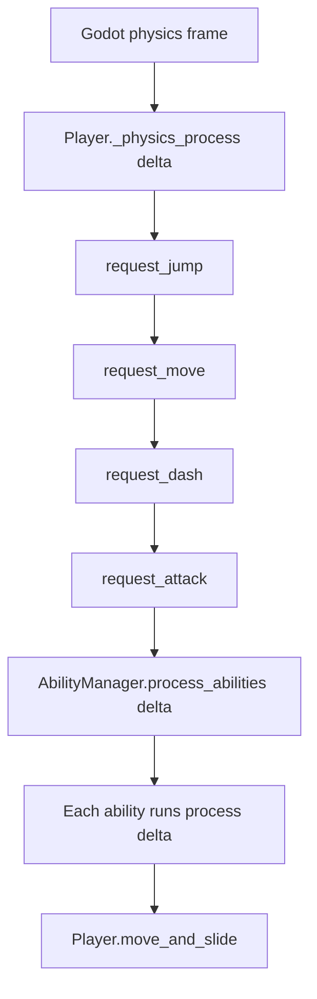
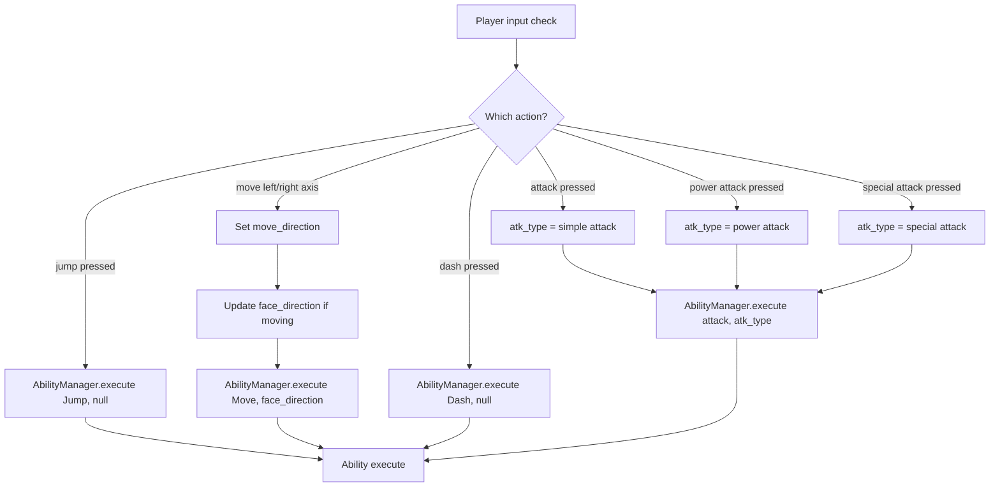
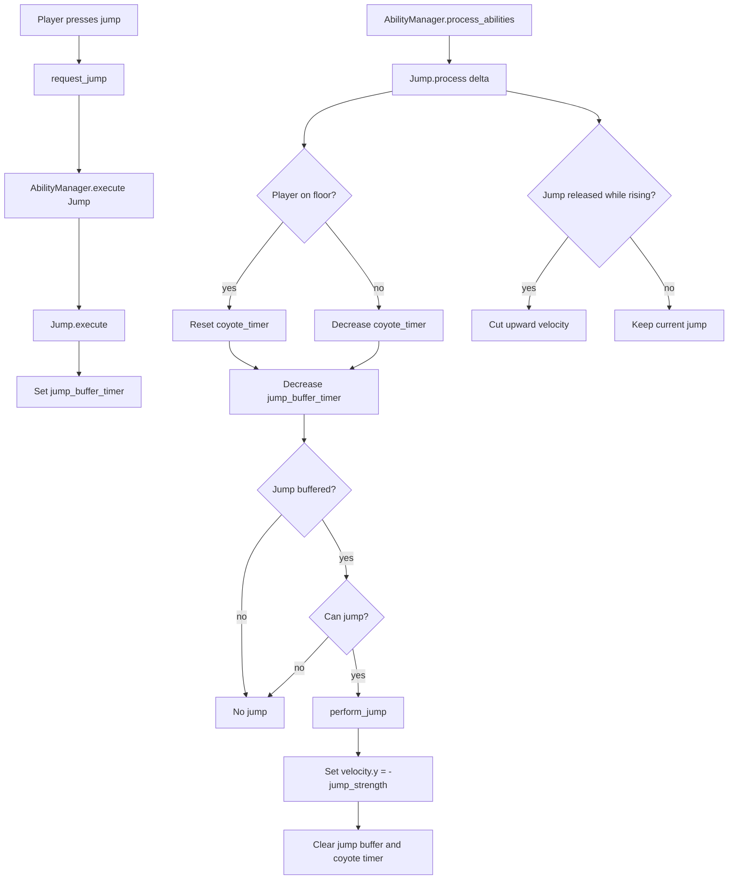
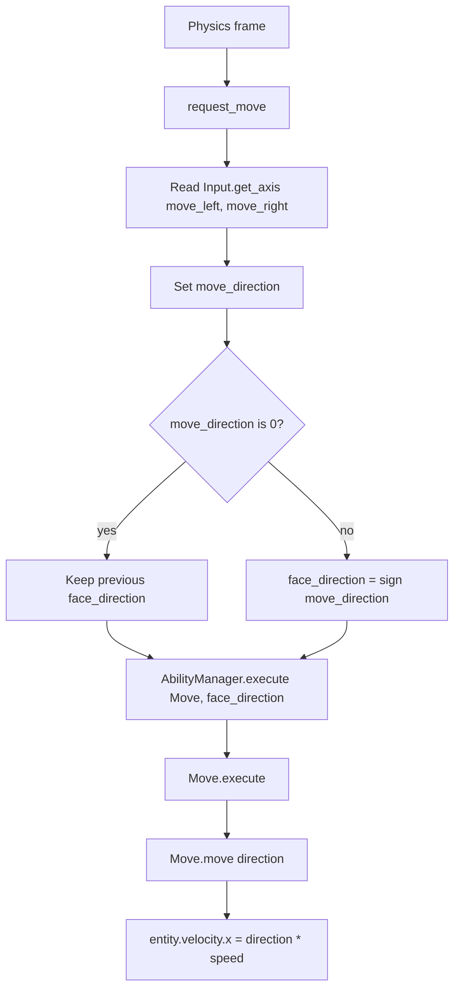
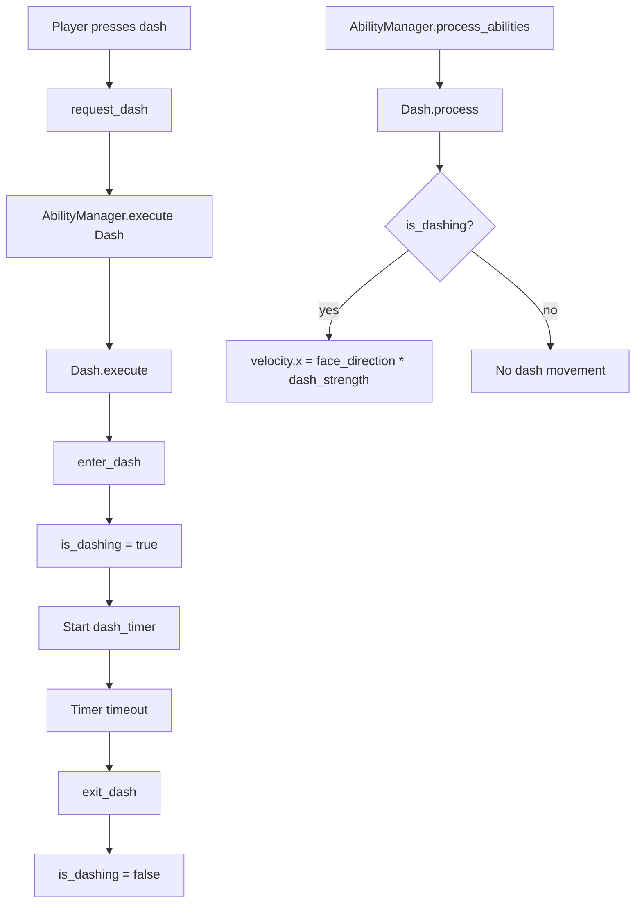
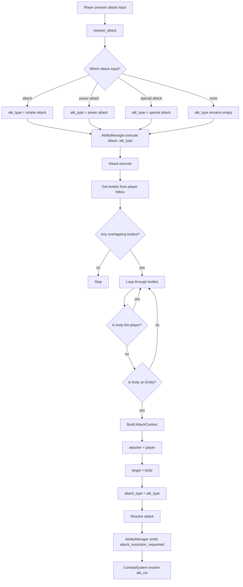
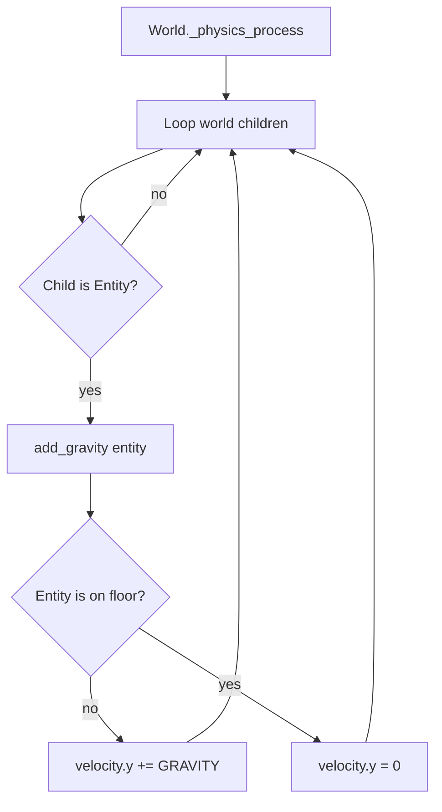

# Player Flow Diagrams

These diagrams show how the player script drives abilities each physics frame.

## Player Physics Frame

## Ability Request Flow

## Jump Flow

## Move Flow

## Dash Flow

## Attack Flow

Note: `Attack.resolve()` currently calls `ability_manager.resolve_attack(atk_ctx)`, while `AbilityManager` defines `request_attack_resolution(atk_ctx)`. The final two nodes show the intended signal flow.

## World Gravity Around Player

