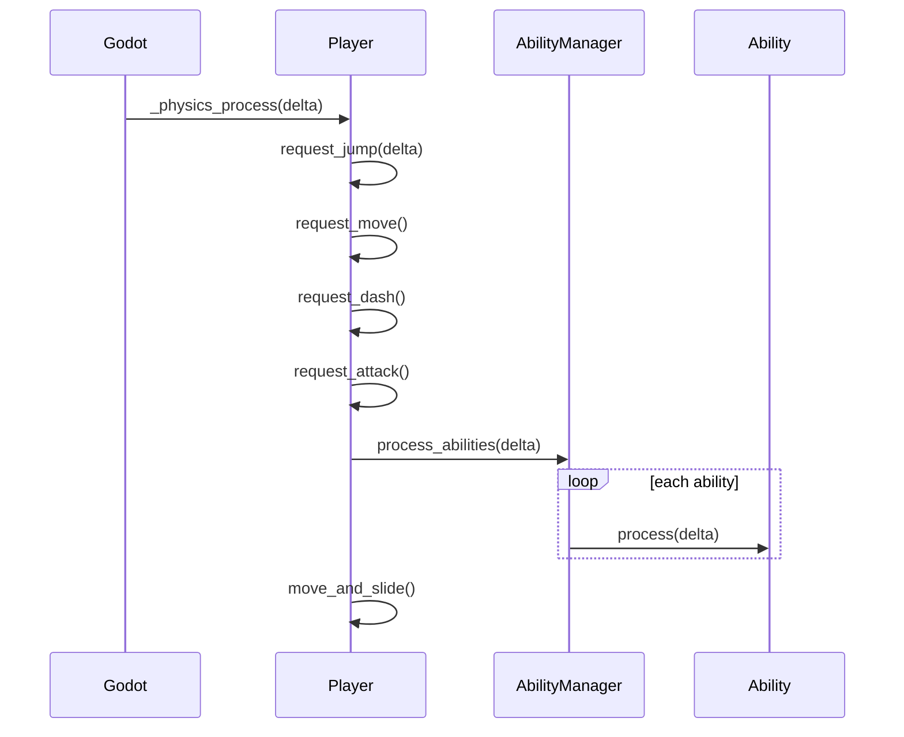
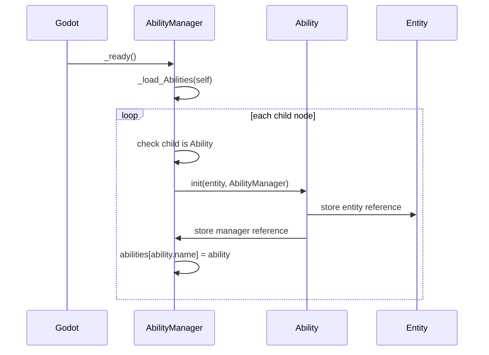
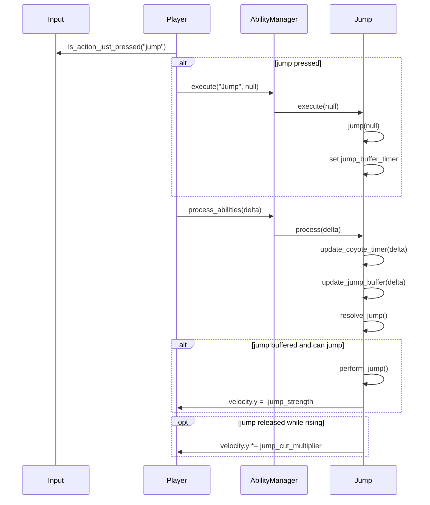
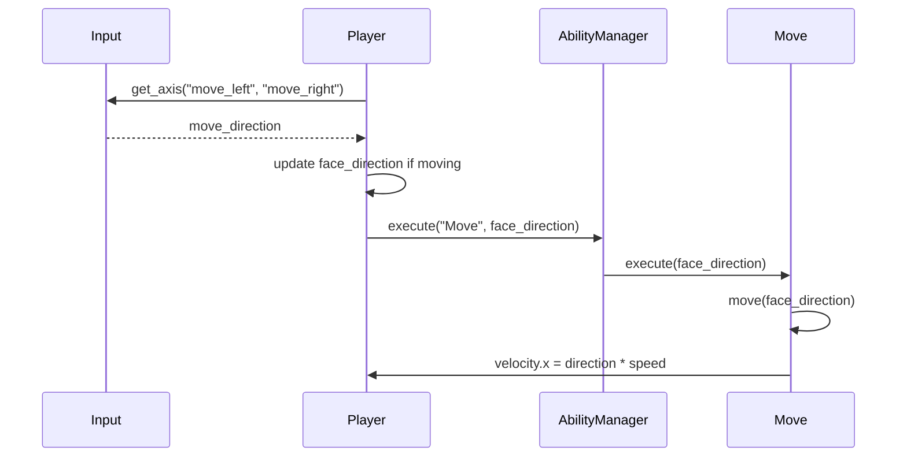
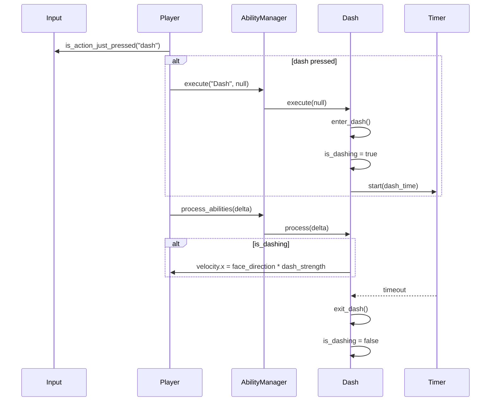
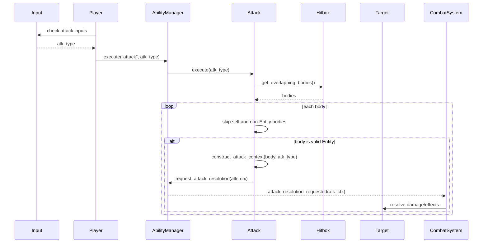
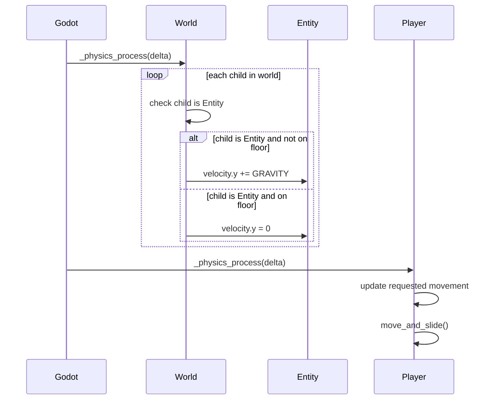

# Player Sequence Diagrams

These diagrams show message order between the player, abilities, and game systems.

## Player Physics Frame

## Ability Loading

## Jump Input

## Move Input

## Dash Input

## Attack Input

Note: `Attack.resolve()` currently calls `ability_manager.resolve_attack(atk_ctx)`, but `AbilityManager` defines `request_attack_resolution(atk_ctx)`. This diagram shows the intended signal-based sequence.

## World Gravity And Player Movement

